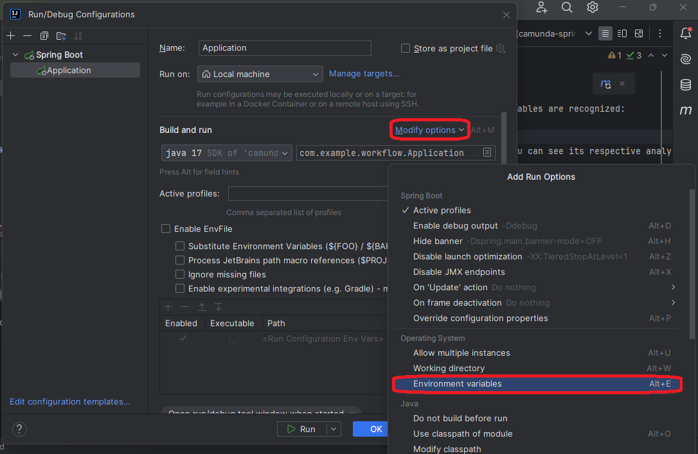
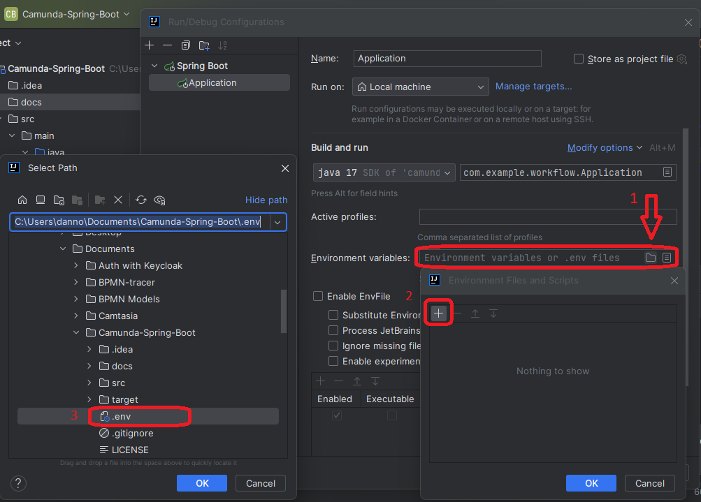

# Camunda-Spring-Boot
Spring Boot 2.79 project that integrates the Camunda Engine 7.19.0 using a PostgreSQL database.

## Index

1. [Description](#description)
2. [Prerequisites](#prerequisites)
3. [Usage](#usage)


## Description

[Camunda Automation Platform 7 Initializr](https://start.camunda.com/) is a tool that facilitates the creation of Spring Boot projects that integrate the Camunda engine, an open source business process engine. Spring Boot is a development framework that simplifies the creation of Java applications, and the Camunda engine enables the execution and management of workflows and business processes. This tool preconfigures the project structure and necessary dependencies, allowing developers to start working on business process automation applications efficiently and quickly.


## Prerequisites

To use this program you need the following:

1. **Version control system**: Install GIT from the [GIT official website](https://git-scm.com/downloads).

2. **IntelliJ IDEA or VSCODE**: To run and/or modify the project.

3. **Java 17 or higher**: You can get help to download and install the java version by following [this link](https://www.youtube.com/watch?v=oAin-q1oTDw&pp=ygUXY29tbyBjb25maWd1cmFyIGphdmEgMTc%3D)

4. **Maven 3.9**: You can get help to download and install the maven version by following [this link](https://www.youtube.com/watch?v=1QfiyR_PWxU&pp=ygUSaW5zdGFsYXIgbWF2ZW4gMy45)

5. **PostgreSQL**: To storage Camunda Engine schema. [PostgreSQL official website](https://www.postgresql.org/download/) 

## Usage

To use the program you must do:

1. Open a terminal in the folder where you want to download the program and clone it with:

   ```
   https://github.com/danilonunezgil/Camunda-Spring-Boot.git
   ```

2. Open the **Camunda-Spring-Boot** program with IntelliJ or VSCODE and run it

3. Create a .env file in project root folder with the following settings:

   ```
    SPRING_DATASOURCE_URL=jdbc:postgresql://localhost:5432/camunda_engine
    SPRING_DATASOURCE_USERNAME=postgres
    SPRING_DATASOURCE_PASSWORD=password
    
    SPRING_JPA_HIBERNATE_DDL_AUTO=update
    SPRING_JPA_SHOW_SQL=true
    
    CAMUNDA_BPM_ADMIN_USER_ID=demo
    CAMUNDA_BPM_ADMIN_USER_PASSWORD=demo
    CAMUNDA_BPM_ADMIN_USER_FIRST_NAME=Danno
    CAMUNDA_BPM_ADMIN_USER_LAST_NAME=NZ
    CAMUNDA_BPM_ADMIN_USER_EMAIL=danilo.gil98@gmail.com
   ```
4. Perform the following configuration so that the environment variables are recognized:

   1. Select *Application* and *Edit Configurations...*

      

   2. In *Modify options* select *Environment variables*
      
      
   
   3. Find .env file and select it
      
      


5. If the .env file has no problem, you can run the program and access it at the address:
   
   ```
   http://localhost:8080/
   ```
