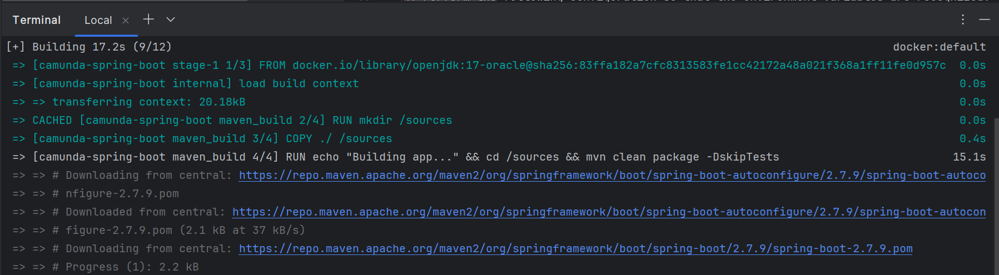
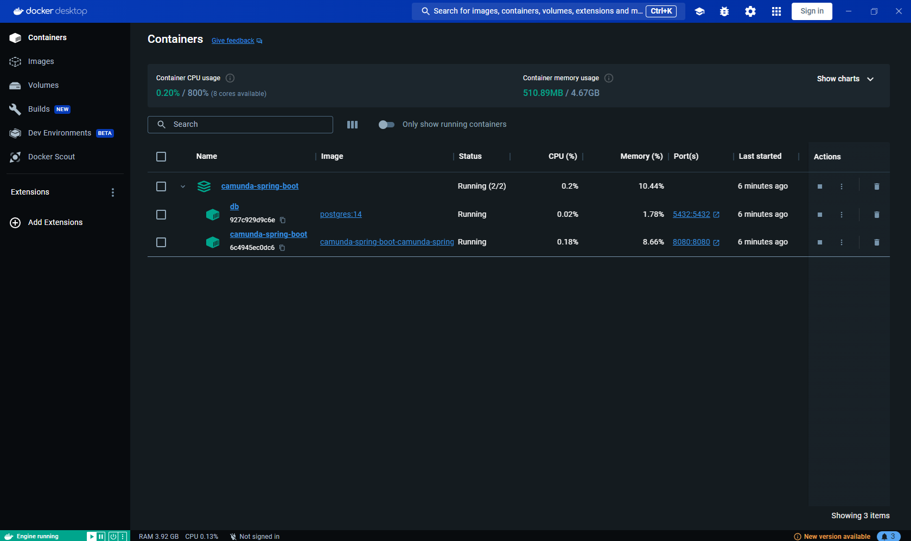
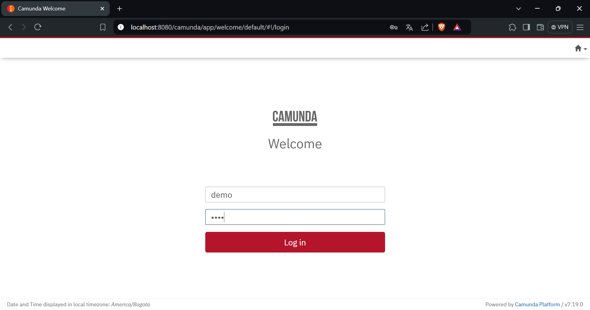
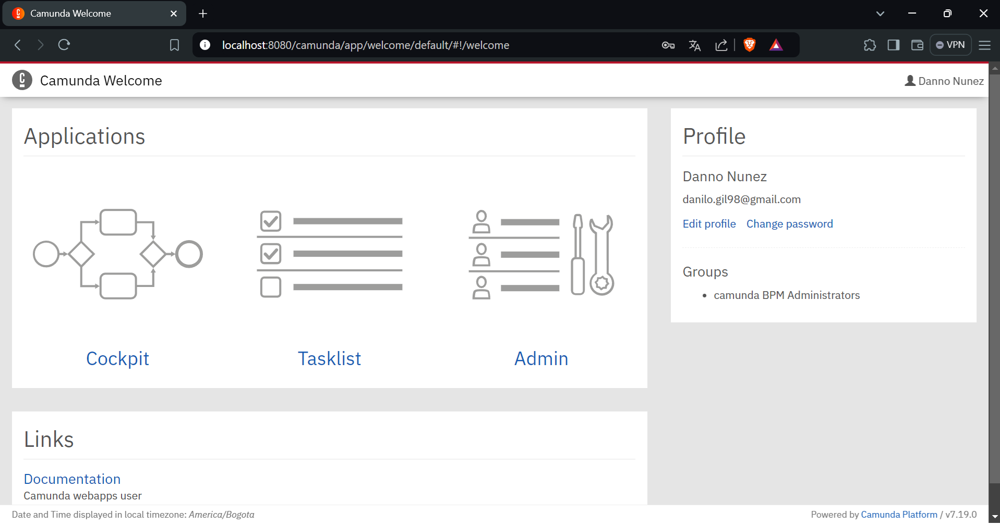
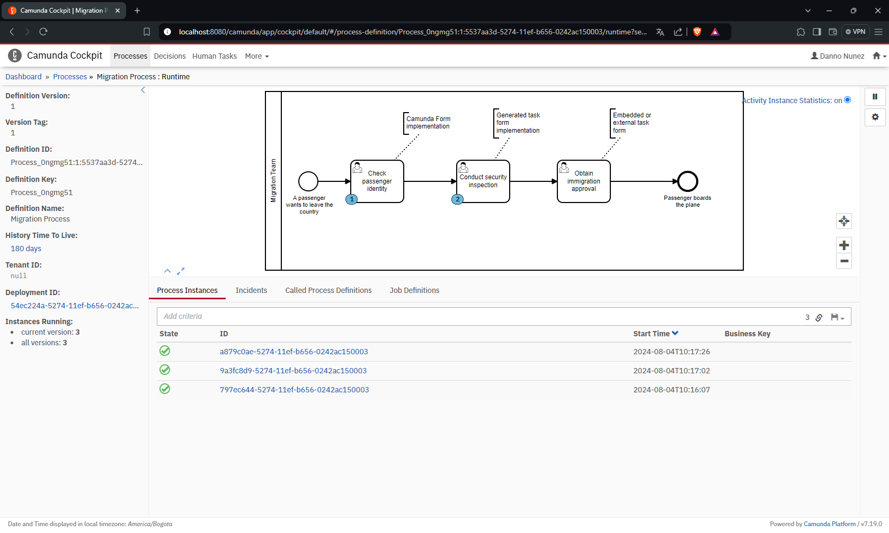

# Camunda-Spring-Boot
This Spring Boot project integrates Camunda Engine 7.19.0 using a PostgreSQL database and is configured to automatically deploy the .bpmn models and forms associated with it (Camunda Forms and HTML forms).

## Index

1. [Description](#description)
2. [Prerequisites](#prerequisites)
3. [Usage](#usage)


## Description

[Camunda Automation Platform 7 Initializr](https://start.camunda.com/) is a tool that facilitates the creation of Spring Boot projects that integrate the Camunda engine, an open source business process engine. Spring Boot is a development framework that simplifies the creation of Java applications, and the Camunda engine enables the execution and management of workflows and business processes. This tool preconfigures the project structure and necessary dependencies, allowing developers to start working on business process automation applications efficiently and quickly.


## Prerequisites

To use this program you need the following:

1. **Version control system**: Install GIT from the [GIT official website](https://git-scm.com/downloads).

2. **IntelliJ IDEA or VSCODE**: To modify the project if it's necessary.

3. **Docker**: Install from the [Docker official website](https://www.docker.com/) 

## Usage

To use the program you must do:

1. Open a terminal in the folder where you want to download the program and clone it with:

   ```
   https://github.com/danilonunezgil/Camunda-Spring-Boot.git
   ```

2. Create a .env file in project root folder with the following settings:

   ```
   # Database configuration
   SPRING_DATASOURCE_URL=jdbc:postgresql://db:5432/camunda_engine
   SPRING_DATASOURCE_USERNAME=postgres
   SPRING_DATASOURCE_PASSWORD=admin
   
   # PostgreSQL configuration
   POSTGRES_DB=camunda_engine
   POSTGRES_USER=postgres
   POSTGRES_PASSWORD=admin
   
   # JPA configuration
   SPRING_JPA_HIBERNATE_DDL_AUTO=update
   SPRING_JPA_SHOW_SQL=true
   
   # Camunda configuration
   CAMUNDA_BPM_ADMIN_USER_ID=demo
   CAMUNDA_BPM_ADMIN_USER_PASSWORD=demo
   CAMUNDA_BPM_ADMIN_USER_FIRST_NAME=Danno
   CAMUNDA_BPM_ADMIN_USER_LAST_NAME=Nunez
   CAMUNDA_BPM_ADMIN_USER_EMAIL=danilo.gil98@gmail.com
   ```
3. Open a terminal inside **Camunda-Spring-Boot** and run the project with:

   ```
   docker-compose up --build -d
   ```

   * The project will be built:

   

   * The project containers were built
         
   

4. You can run the program and access it at the address:
   
   ```
   http://localhost:8080/
   ```
   * In the Camunda login you can access with credentials defined in the .env:
   
   * Camunda Engine is ready to use:
   
   * Process deployed and process instances running:
   
